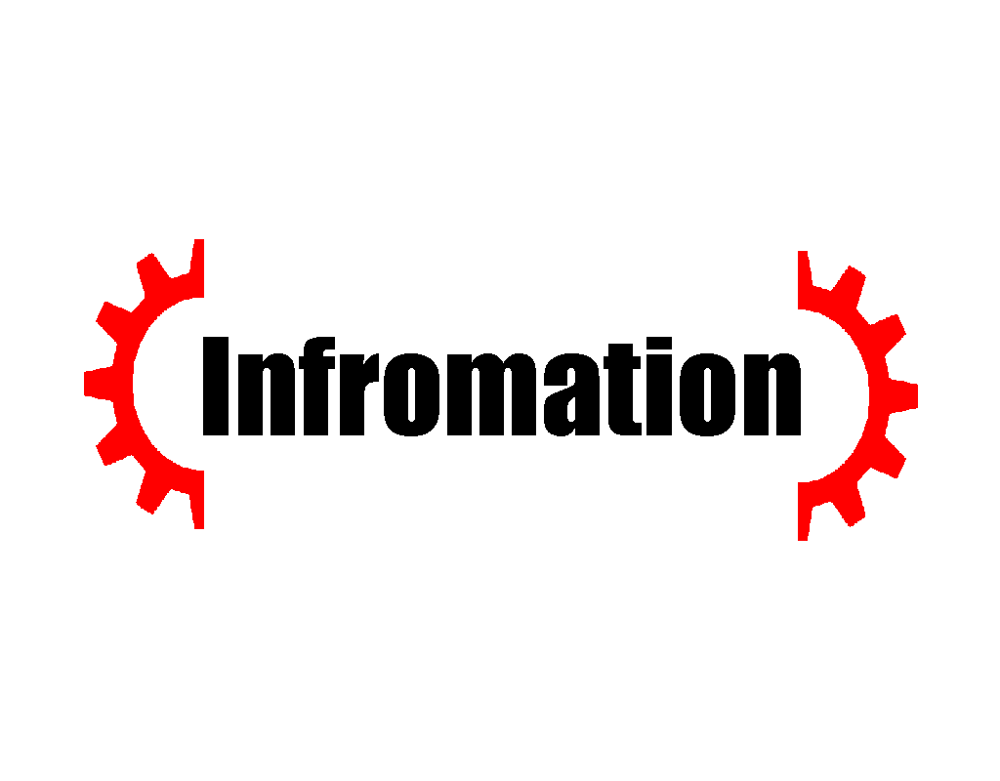
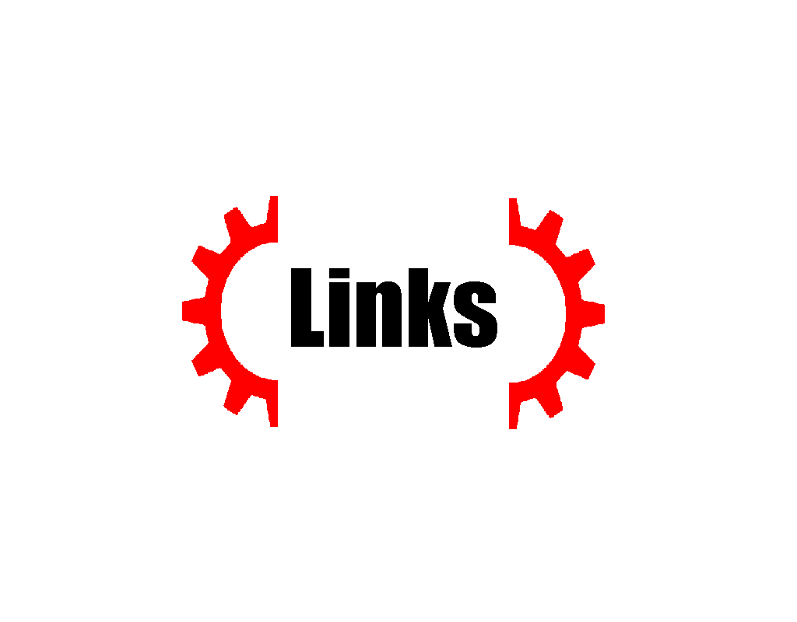
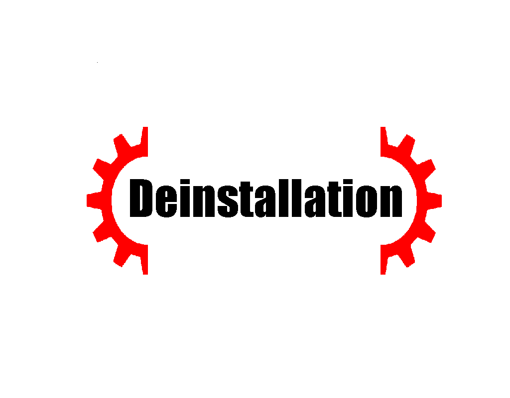



  

    <!--<a href="https://github.com/zTBBz/TBB/releases/latest">
      -->
    </a>
    
     
    
    
    
  

## Traveler's Bag Build or Mod-Union (TBB) ##

Mod-Union is a big project, it will include MTP and SMaD, as well as all new mods under my authorship. All mods become Mod-Union modules with great relative autonomy. That is, Mod-Union can update only one module for each update and it will be indicated which module was updated and, of course, what exactly was updated. 

1.  When will Mod-Union be released????
    1.  Well, the work continues. 35% of all the work on the transfer of MTP and SMaD has already been done, only the transfer, not the update. The Mod-Union beta will be released soon, you will be able to look at the progress and some new features.

1.  Why aren't SMaD and MTP updated?
    1.  SMaD and MTP are updated. Just on their pages on GameBanana and on GitHub, they will not be updated.

1.  I downloaded Mod-Union, but I have all the items and everything else without names, or they just don't exist
    1.  Check the correct installation, your version of the game, you have installed [Networking DLL Fix](https://discord.com/channels/187414758536773632/433748059172896769/764059349000781874)

1.  I've seen SMaD sprites - they're terrible, I'm a pixel artist can I help?
    1.  Sure. Sprites are always needed. Write to me in DM Discord (T.B.B#3317)

1.  I want to write sounds for items and others, where should I turn?
    1.  Write to me in DM Discord (T.B.B#3317)

*  [Download TBB](https://github.com/zTBBz/MTP/releases)
*  [RogueLibs on GitHub](https://github.com/Abbysssal/RogueLibs)
*  [aToI on GitHub](https://github.com/Abbysssal/aToI)
*  [Networking DLL Fix](https://discord.com/channels/187414758536773632/433748059172896769/764059349000781874)
*  [MTP Traits table](https://docs.google.com/spreadsheets/d/1kySq44n0-29RoTd5aPPAJifNcYvBeIGS0MIgwUOwTv4/edit#gid=0)
*  [Official SoR Discord](https://discord.gg/AMww6nP2Af)
*  [Official RU SoR Discord](https://discord.gg/neDvsmk)

1.  Install BepInEx:
    1.  [Download the latest version of BepInEx](https://github.com/BepInEx/BepInEx/releases/latest);
    2.  Drag all files from the archive into directory /Steam/SteamApps/common/Streets of Rogue/;
    3.  Run the game, so BepInEx can create needed files and directories, and close the game;
2.  Install RogueLibs:
    1.  [Download RogueLibs v3.0.0-rc.4](https://github.com/Abbysssal/RogueLibs/releases);
    2.  Drag the file "RogueLibsCore.dll" into directory /Steam/SteamApps/common/Streets of Rogue/BepInEx/plugins;
    3.  Drag the file "RogueLibsPatcher.dll" into directory /Steam/SteamApps/common/Streets of Rogue/BepInEx/patchers;
3.  [Download the latest version of TBB](https://github.com/zTBBz/TBB/releases/latest);
4.  Drag the file "TBB.dll" into directory /Steam/SteamApps/common/Streets of Rogue/BepInEx/plugins;
5.  Done! Now run the game and enjoy!

1.  Just remove "TBB.dll" from /Steam/SteamApps/common/Streets of Rogue/BepInEx/plugins.
